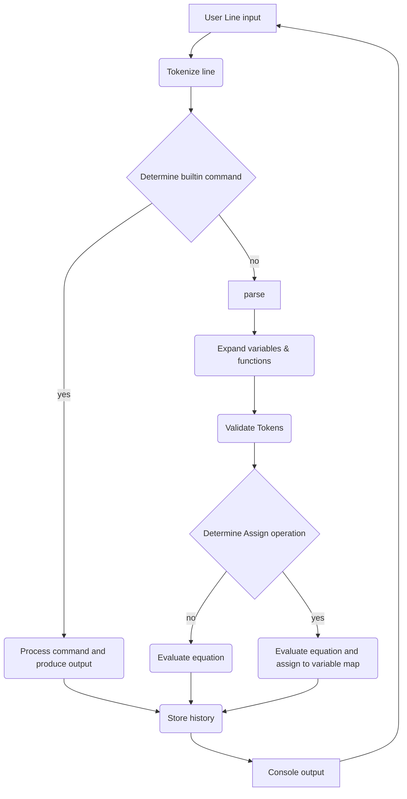

# Computorv2
 **ComputorV2**. Is calculator shell which is inspired by the unix program; [bc](https://manpages.ubuntu.com/manpages/impish/man1/bc.1.html).

## Installation
Clone repo
`git clone https://github.com/neosizzle/computorv2.git`

Install and run
`make && ./computor`

Uninstall
`make fclean`

## Features

- Computation of rational numbers
- Computation of Imaginary numbers
- Computation of Matrices
- Computation across different number types (if possible)
- Function creation with said number types
- Assignment and reassignment of variables
- Resolution of an equation of degree less than or equal to 2
- History of commands
- List current variables
- Matrix Inversion
- BODMAS equation resolution

## This is the part where I explain (Documentation)

### Flow chart (Bird eye view)

### User input and tokenization
1. I used the [GNU readline](https://linux.die.net/man/3/readline) library to read user input from console.
2.  The line is then split into smaller strings based on what type of token they are (Operators? operands? Variables?). The type is determined by the program and the info (token string and type) is stored inside a token vector.
3. It will then do free form optimization (Adding \* for terms like ab -> a\*b and a(b) -> a\* (b))

### Token parsing
1. The tokenized string is then passed through a parser, where it will give additional context and value to said tokens.
2. The parser will iterate through the tokenized string
3. For every token it encounters, it will construct the corresponding class with for the token type. (the token string "124" will become a RationalNumber(1234) class token)
4. It will also determine if the last token is a question mark `?`. This will tell the evaluator if its a assignment operation or computation operation

### Variable and function expansion
1. The expander will iterate through the parsed tokens to find and variables and functions that need to be expanded. It will try to expand the variables and functions if possible.
2. It will validate the position and the value of the tokens in the list

### Evaluation of tokens
1. Populate the tokens according to BODMAS rules. (Add parentheses around every term which needs to be prioritized first)
2. Pair the tokens for the binary parse tree
3. After the tokens are done populated, generate the token evaluation tree using these [rules](https://www.shmoop.com/computer-science/cs-trees/math-expressions.html)
4. After the parse tree is formed, evaluate the parse tree

### Evaluation resolution
1. After result is obtained (usually will just be one token)
2. If its a computation action, print result to console
3. If its a assignment action, store result in variable
4. Record the result and command as history
